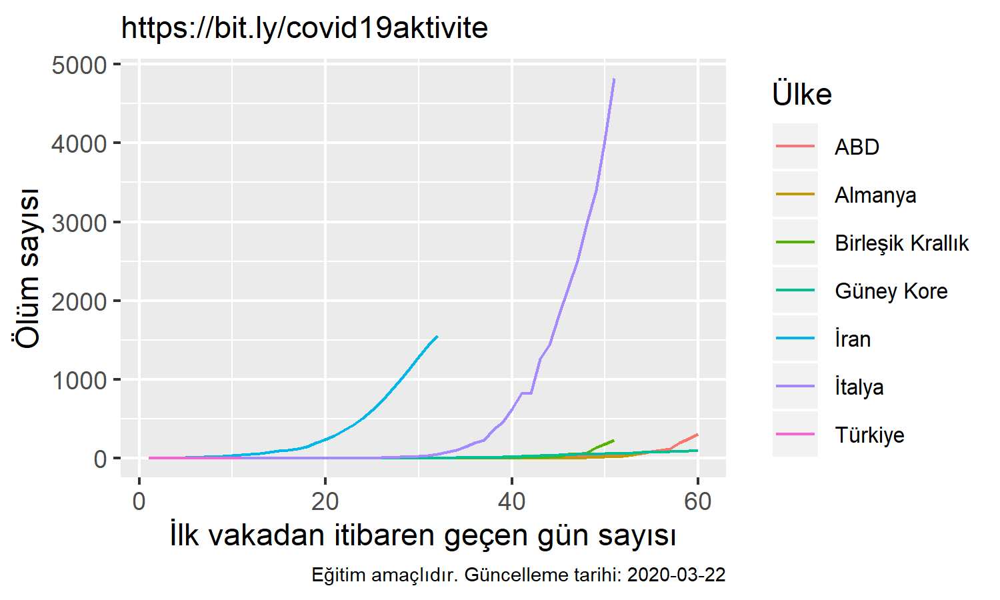
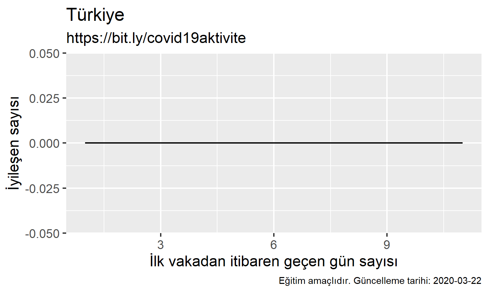

# COVID-19 Verileri

Aktivite Yazarı: Mine Doğucu ([@MineDogucu](https://twitter.com/MineDogucu))

En son elde edilen veri tarihi: 18 Mart 2020

Lütfen bu formun __tamamını__ okuyun, sadece figürlere bakmayın. 

## Bu kaynağın amacı

Bu kaynak tamamen eğitim amaçlıdır. Öğrencilere istatistiğin, matematiğin, veri biliminin önemini güncel konu ile anlatmak isteyen eğitimciler kullanabilirler. Herhangi spesifik bir dersi amaçlamamak ile birlikte, birkaç derste kullanılabilir. Örneğin:

- İstatik derslerinde açık kaynaktaki R kodu örnek olarak kullanılabilinir.
- Veri bilim derslerinde görseller eleştirebilinir.
- Calculus dersinde fonksiyonların artış hızları karşılaştırabilinir.

Kısacası amaç, öğrencilerin bunu öğrenmek ne işime yarayacak ki söylemlerini azaltmak. Matematiği ve istatistiği gündelik hayattan örnekler vererek öğretmek.

## Veri kaynağı

Veriler John Hopkins Üniversitesi, Whiting Mühendislik Fakültesi, Sistemler Bilimi ve Mühendisliği Merkezi'nin sunduğu COVID-19 [GitHub reposundan](https://github.com/CSSEGISandData/COVID-19) alınmıştır.

Bu kaynakta belirtildiği üzere, veriler Dünya Sağlık Örgütü ve birçok devlet sağlık kurumlarından elde edilmiş. Bu verilerin hakkı John Hopkins Üniversitesine aittir ve sadece eğitim ve akademik araştırma amaçlı kullanıma açıktır. Verilerin farklı kaynaklardan gelmesinden dolayı verilerin doğruluğuna dair garanti vermemektedirler. Medikal yönlendirme veya ticaret amacı ile kullanılması kesinlikle yanlıştır. Verileri kullanmak isterseniz direk ana kaynaktan faydalanın.

## Uyarılar

Kaynağı kullanırken dikkat edilmesi gerekilenler:

- Elimden geldiğince figürleri güncelleyeceğim. Bu linki kaydedin ve en güncel halini kullanın.
- Figürleri herhangi biri ile paylaşırsanız, mutlaka ama mutlaka, bu linki de paylaşın. Böylelikle kaynağın yanlış kullanılmasının önüne geçmiş oluruz.
- Eğitim ortamında oran konusunun tartışmasına yol açması için sayılar nüfusa oranlanmadan verilmiştir.
- x ve y eksenlerinin limitleri grafikten grafiğe değişmektedir. Grafikler arası karşılaştırma yaparken dikkat edilmelidir. 
- Bu konuyu ele almak hem öğrenende hem de eğitimcide strese neden olabilir. 
- Bir eğitimci olarak şahsi fikrim: bu konu ele alınırken hem bilimin hem de toplu eylemin önemi vurgulanmalıdır.
- Bu kaynak hata içerebilir. Eğer hata görüyorsanız GitHub'da issue açabilirsiniz veya bana email üzerinden ulaşabilirsiniz.
- BU AKTİVİTE SADECE EĞİTİM AMAÇLIDIR. SAĞLIK İLE İLGİLİ SONUÇLARIN ÇIKARILMASI DOĞRU DEĞİLDİR. HASTALIKLARIN YAYILMA HIZI, ŞEKLİ, SAĞLIK POLİTİKALARININ ETKİLERİ DAHA KOMPLEKS MODELLEMELER İÇERMEKTEDİR.

Öğrencilerin en merak edeceği noktalardan biri neden Çin'in verilerinin olmadığı olacaktır. Aslında veri kaynağında Çin verileri mevcut fakat ben bilinçli olarak kullanmadım. Bunun iki sebebi var. Birincisi sayıların nüfustan dolayı yüksek olduğundan, oran kullanmadan diğer ülkeler ile karşılaştırılması zor. İkincisi ise son zamanlarda Çinlilere karşı artan ırkçı söylemlerin eğitim ortamından uzaklaştırılmaya çalışmam.

## Karşılaştırmalı Figürler

## Sadece Türkiye'ye Ait Verilerin Figürleri

UYARI!! Türkiye'ye dair veriler çok az olduğu için bu figürler zaman içerisinde daha anlamlı olacaktır.

